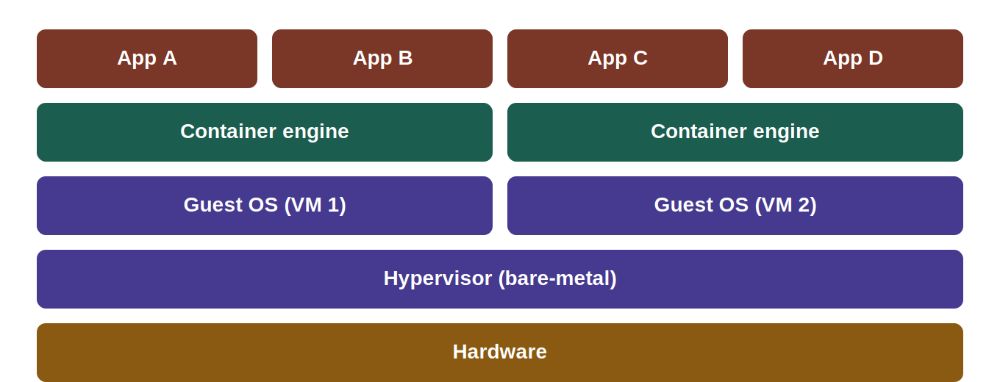
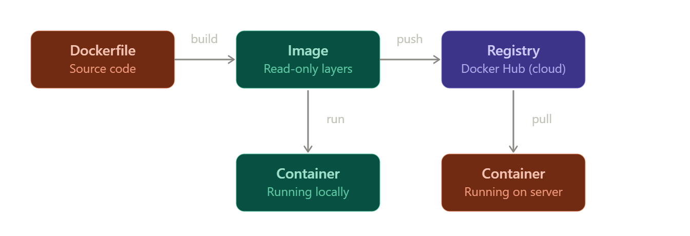

# Docker Fundamentals & Core Concepts

## 1. What is an Operating System?
An operating system (OS) is the foundational software layer that acts as a bridge between physical hardware and users or applications. It manages all system resources and hides hardware complexity, providing a standardized environment for programs to run.

**Core Responsibilities:**
* CPU Management
* RAM (Memory) Management
* Storage and File Management
* I/O (Input/Output) Operations
* Security and Isolation

## 2. What is Virtualization?
While a standard operating system claims and manages all physical hardware by itself, virtualization is the technology that logically divides these physical resources, allowing multiple isolated operating systems to run simultaneously on the same physical server.

At the core of this architecture is the **Hypervisor**, a software layer that bridges physical hardware and virtual operating systems. The hypervisor treats physical resources as a shared pool and allocates them to each Virtual Machine as if it had its own independent hardware. This ensures hardware efficiency and provides high flexibility in system management.

## 3. What is a Virtual Machine (VM)?
A virtual machine is a completely isolated logical computer system created when a hypervisor simulates physical hardware such as the CPU, RAM, Disk, and Network Interface Card.

## 4. What is a Container?
Containers are isolated, lightweight software packages that bundle an application's code, runtime, system tools, and libraries needed to run. However, unlike VMs, they do not contain their own full operating system. Instead, they share the host server's operating system kernel.

> *A container is essentially nothing more than an isolated, lightweight Linux process.*

### Key Advantages:
* **High Speed:** Since there is no full operating system to boot, containers can start and stop in a matter of milliseconds.
* **Resource Efficiency:** They only take up megabytes of space. A physical server can run dozens of times more containers compared to traditional VMs without hitting hardware limits.
* **Environmental Consistency:** Containers package all the required libraries and version dependencies inside themselves. This means a container built on a developer's local machine will run flawlessly on a production server without any compatibility issues.

## 5. Container Architecture vs. Virtualization
The fundamental distinction in system architecture is this: **Virtual machines virtualize the hardware layer, whereas containers virtualize the operating system layer.**

**In VM Architecture:**
Even to run a small application (e.g., a 50 MB web service), a fully-fledged Guest OS must be installed. This leads to wasted system resources due to background services consuming extra RAM, gigabytes of disk space reserved for the OS, and significantly longer boot times.

**In Container Architecture:**
The code, libraries, and configurations required for the application are bundled into a single lightweight package. Because they lack their own internal OS, they securely share the Host OS kernel.

> **In summary:** Virtualization safely and powerfully divides the hardware, while container architecture packages the software in a lightweight and highly efficient manner.

## 6. What is Docker?
Docker is a platform that allows you to package applications and everything they need to run (libraries, configurations, dependencies) into standardized units called **Containers**.

The fundamental difference from Virtual Machines (VMs) is that while VMs simulate an entire operating system along with the hardware, Docker containers share the host machine's operating system kernel. This makes them incredibly lightweight structures that take up megabytes instead of gigabytes and start up in seconds.

### Why Use Docker?
* **Environment Reproducibility:** Everyone encounters the exact same setup. The classic "it works on my machine, but broke on the server" excuse is completely eliminated.
* **Dependency Management:** There are no OS-specific issues or library conflicts. For example, a specific Java version required for a Spring Boot application is securely isolated inside that specific container without affecting the rest of the host system.
* **Portability:** Once a container is created, it runs flawlessly on any machine with Docker installed. This could be your development laptop, an AWS cloud instance, or your own Ubuntu lab server.
* **Version Control:** The `Dockerfile`, which defines the system infrastructure and requirements, is a plain text file. Just like source code, it can be instantly versioned and managed via Git.

## 7. What is Docker Hub? (DevOps & Infrastructure)
Docker Hub is the world's largest cloud registry where Docker images (packaged, ready-to-run applications) are stored, shared, and distributed.

### The DevOps Workflow:
1. **Build:** You convert your Spring Boot application into a Docker image.
2. **Push:** You upload this image to your Docker Hub repository using the `docker push` command.
3. **Pull & Run:** You connect to your production server (e.g., on vCenter/ESXi), download the image in seconds with `docker pull`, and instantly spin it up with `docker run`.

> **The Critical Rule:** An **Image** is passive; it is a dormant file sitting on a hard drive. A **Container** is the active, living instance of that image loaded into RAM. *(Exactly like the difference between a Program and a Process).*

### Ready-Made Images
Docker Hub isn't just for your own code. Instead of spending hours installing and configuring official systems like MySQL, Nginx, Redis, or Ubuntu, you can pull them with a single line of code and have them ready in 10 seconds.

## 8. Docker Architecture and Core Components
Docker uses a client-server architecture. Understanding how these core components interact is essential for mastering containerization.

### 1. Docker Client (The Command Center)
This is your terminal or command prompt (CMD). As a developer, this is where you type commands like `docker run` or `docker build`. The client itself doesn't run the containers; it simply accepts your commands and communicates them to the "brain" (the Daemon) running in the background to do the heavy lifting.

### 2. Docker Host & Daemon (The Machine & The Brain)
* **The Host:** The physical machine or virtual server where Docker is installed (e.g., your Ubuntu server running on VMware/vCenter).
* **The Daemon (`dockerd`):** The absolute heart of the Docker system. It runs 24/7 in the background on the Host. It listens for commands from the Docker Client, builds images, starts or stops containers, and manages communications with external registries.

### 3. Docker Images (The Frozen Mold)
Images are read-only templates used to create containers. You can think of them as the packaged, frozen version of your source code, operating system libraries, and all the dependencies required for your application to run perfectly.

### 4. Docker Containers (The Living Product)
A container is the live, active, running instance of an image that has been loaded into RAM. They are extremely lightweight, isolated processes that run application code reliably by utilizing the Host OS kernel rather than booting their own.

### 5. Docker Registries (The Cloud Repository)
Registries are centralized storage locations where Docker images are hosted and distributed. **Docker Hub** is the most famous public registry. You download (`Pull`) the images you want to use on your servers from here, and you upload (`Push`) your own custom-built images back to it for deployment.

## 9. The Docker Lifecycle & Layer Architecture

When Docker builds an image from a `Dockerfile`, it converts each instruction (e.g., `FROM`, `RUN`, `COPY`) into a unique, **read-only layer**.

**Smart Caching:** Docker caches these intermediate layers. To optimize build speed and keep the image size small, rarely changing steps (like installing OS dependencies) should be placed at the top of the `Dockerfile`, while frequently changing files (like source code) should be at the bottom.

When an image is executed to create a container, all the underlying base image layers remain completely locked and read-only. Docker simply adds a thin **Writable Layer** on top.

Any operations, file creations, or modifications made while the container is running are stored only in this temporary writable layer, leaving the base image pristine and untouched.

Before diving into specific CLI commands, it is crucial to understand the conceptual journey of an application within the Docker ecosystem. The workflow follows four main stages:

1. **Build (Code $\rightarrow$ Image):** A `Dockerfile` is compiled into a read-only Image on your local development machine.
2. **Run (Image $\rightarrow$ Container):** The Image is brought to life, becoming an active, isolated Container.
3. **Push (Local $\rightarrow$ Cloud):** To distribute the application, the finalized Image is uploaded to a central cloud registry (like Docker Hub).
4. **Pull (Cloud $\rightarrow$ Server):** A production server (or another developer's machine) downloads the exact Image from the cloud and runs it instantly, without needing the original source code or a new build process.

## 10. Docker Compose (Multi-Container Orchestration)

### What is Docker Compose?
Docker Compose is an official tool designed to define, run, and manage multi-container Docker applications. Instead of managing individual containers one by one, Compose allows you to treat a cluster of interconnected containers as a single, cohesive application.

### Core Capabilities
* **Multi-Container Management:** In modern software architecture, an application rarely runs in just one container. A standard setup often requires a backend API (like Spring Boot), a relational database (like MySQL), and perhaps a frontend server or cache. Compose manages all these distinct containers through a single, declarative text file named `docker-compose.yml`.
* **Simultaneous Operations:** Instead of executing long, complex `docker run` commands for each service sequentially, Compose allows you to create, start, stop, and tear down multiple dependent containers simultaneously on a single host machine using just one command (e.g., `docker compose up`).
* **Dependency & Network Management:** It automatically creates an isolated internal network for your containers to communicate seamlessly. Furthermore, it ensures services start in the correct sequence (e.g., guaranteeing the database is fully initialized before starting the backend application).

## 11. Kubernetes (K8s) vs. Docker Compose

### The Limits of Docker Compose
While Docker Compose is an excellent tool for defining and running multi-container applications, its primary limitation is that it operates on a **single host machine** (e.g., one Ubuntu server).

If your application becomes highly popular and that single server runs out of CPU or RAM, or if the physical server crashes, Docker Compose alone cannot automatically move your containers to a different, healthy server.

### What is Kubernetes?
Kubernetes (often abbreviated as **K8s**) is an enterprise-grade container orchestration platform originally developed by Google. If Docker Compose orchestrates containers on a *single* machine, Kubernetes orchestrates containers across a **Cluster of multiple machines** (nodes).

### Key Kubernetes Features (Enterprise Scale)
1. **High Availability (Self-Healing):** If a container or an entire server crashes, K8s detects the failure and instantly spins up a replacement container on a healthy machine.
2. **Auto-Scaling:** If traffic suddenly spikes, K8s automatically creates exact copies of your Spring Boot containers to handle the load, and destroys them when the traffic drops to save resources.
3. **Load Balancing:** It seamlessly distributes incoming web traffic across all the running container copies to ensure no single server is overwhelmed.

> **Summary:** You use Docker Compose for local development, testing, and small-scale deployments. You use Kubernetes for massive, enterprise-level, highly available production systems.

