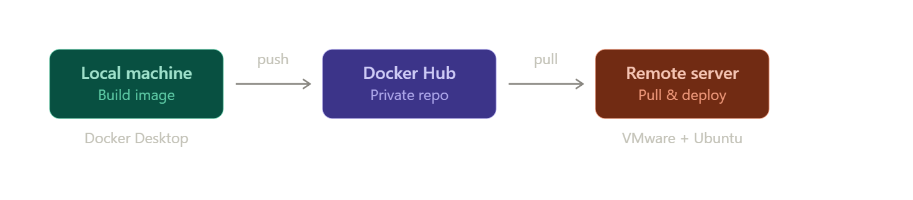
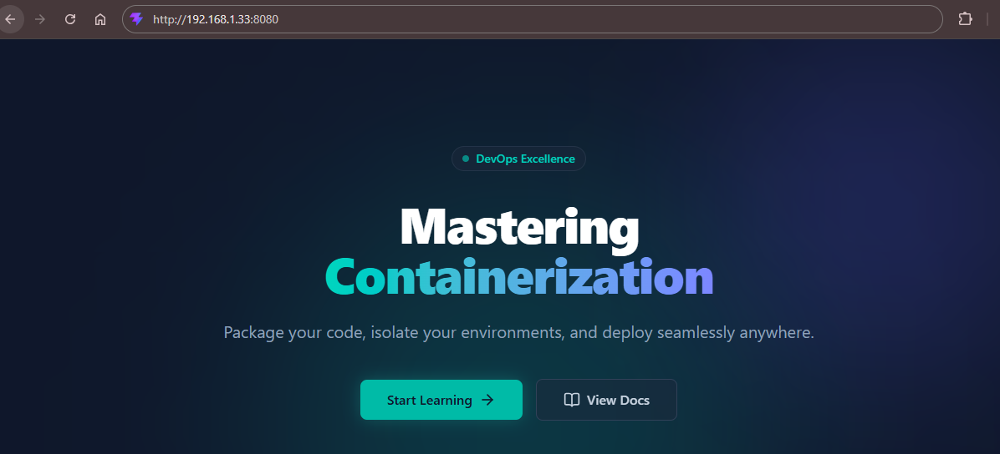
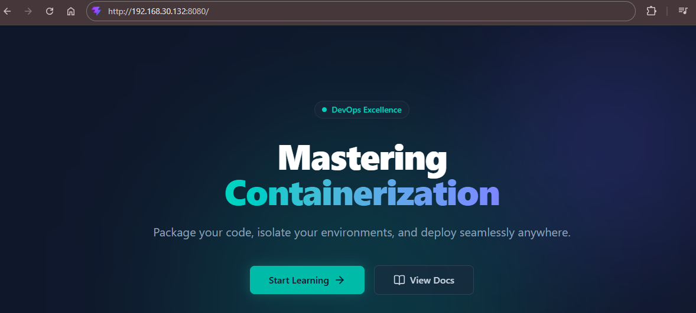

## Project Description
This project demonstrates the end-to-end containerization and deployment of a modern frontend web application (React/Vite). The primary goal is to establish a robust DevOps workflow where the application is built locally, stored in a centralized container registry, and deployed to an isolated server environment.

## Deployment Workflow
The deployment architecture follows a standard build-ship-run pipeline:
1. **Build:** Create a customized Docker image locally from the project source code using a multi-stage `Dockerfile`.
2. **Push:** Upload the built image to a Docker Hub repository.
3. **Pull:** Authenticate and download the image from Docker Hub onto the remote server.
4. **Deploy:** Run the image as a containerized service, configuring ports, restart policies, and health checks.



## Lab Environment Setup
To simulate a real-world production deployment, the following infrastructure was established:

* **Local Machine (Development Environment):**
    * **Tools:** Docker Desktop, IDE.
    * **Purpose:** Developing the React/Vite application, writing configuration files, and building/pushing the initial Docker images.
      <br><br/>
* **Remote Server (Production Environment):**
    * **Hypervisor:** VMware Workstation.
    * **Operating System:** Ubuntu Server.
    * **Tools:** Docker Engine, Docker CLI.
    * **Purpose:** Acting as the host machine to pull images, run containers, and manage networking/reverse proxies for multi-host capabilities.

## Repository Structure
The repository contains the necessary configuration files to containerize and serve the application efficiently:
* `Dockerfile`: Defines the multi-stage build process (using Node.js for building the Vite app and Nginx-Alpine for serving the static files).
* `nginx.conf`: Custom Nginx configuration to handle web traffic and port listening.
* `.dockerignore`: Excludes local development files (like `node_modules/` and `dist/`) to optimize the Docker build context.
* `package.json` & `vite.config.ts`: Core configurations for the frontend React/Vite application.

## Deployment Steps

### 1. Create a Docker Hub Repository
Before building the image, a destination registry is required to store it.

* Go to Docker Hub and log in to your account.

* Create a new repository and set the name to **`mastering-containerization`**.

* Set the visibility to **Private**.

### 2. Prepare the Static Web Project
Ensure your frontend web application is fully prepared and tested locally before containerization.

* The project root directory must contain all essential source code files, including `package.json`, `index.html`, and `vite.config.ts`.

### 3. Create the `Dockerfile`
Create a file named `Dockerfile` at the root level of your project and paste the following code. This configuration uses a **Multi-Stage Build** to compile the app and serve it with a lightweight web server.

```dockerfile
# --- Build Stage ---
# Use a lightweight Node.js image to build the application
FROM node:22-alpine AS builder

# Set the working directory inside the container to /app
WORKDIR /app

# Copy only package files first to leverage Docker layer caching
COPY package*.json ./

# Install dependencies and clean npm cache in a single RUN command to reduce image size
RUN npm install && npm cache clean --force

# Copy the rest of the application source code and compile the project
COPY . .
RUN npm run build


# --- Production Stage ---
# Use a lightweight Nginx image to serve the compiled static files
FROM nginx:alpine

# Copy the build artifacts from the 'builder' stage to Nginx's default public folder
COPY --from=builder /app/dist /usr/share/nginx/html

# PORT CUSTOMIZATION: Change Nginx's default listening port from 80 to 8080 using 'sed'
RUN sed -i 's/listen  *80;/listen 8080;/g' /etc/nginx/conf.d/default.conf

# Document that the container will listen on port 8080
EXPOSE 8080

# Start Nginx in the foreground so the container does not exit
CMD ["nginx", "-g", "daemon off;"]
```

### 4. Create the `nginx.conf` File
Create a custom `nginx.conf` file in the root directory. This file configures the Nginx web server to serve our built React/Vite application correctly and efficiently.

```bash
server {
   listen 8080;
   root /usr/share/nginx/html;
   index index.html;

   location / {
       # Crucial for Single Page Applications (SPA) like React.
       # Redirects all unknown routes to index.html so the frontend router can handle them.
       try_files $uri $uri/ /index.html;
   }

   # Performance optimization: Enable Gzip compression for text-based assets
   gzip on;
   gzip_types text/css application/javascript application/json;
}
```

### 5. Create the `.dockerignore` File
Create a `.dockerignore` file in the root directory. Just like `.gitignore`, this file tells Docker which files and directories to ignore when copying files into the image.

* Faster builds by excluding heavy folders like node_modules.
* Ensures a clean, scratch-built environment by ignoring local dist folders.
* Prevents sensitive .env files from leaking into the public image.

```text
# Git & Environment variables
.git
.gitignore
.env

# Docker configuration files
Dockerfile
.dockerignore

# Dependencies and Local Build Outputs
node_modules
dist
dist-ssr

# Logs
logs
*.log

# IDE & System Files
.vscode
.idea
.DS_Store
```
### 6. Build the Docker Image
Run the following command in the root directory of your project to build the custom image:

```bash
docker build --progress=plain --no-cache -t mastering-containerization .
```

* **`--progress=plain`**: Disables the default flashy progress output and prints a plain, linear text log, making it easier to read build steps sequentially in the terminal.
* **`--no-cache`**: Forces Docker to rebuild every layer from scratch without using any cached layers, ensuring that all dependencies and source code changes are freshly compiled.
* **`-t mastering-containerization`**: Tags the built image as `mastering-containerization` for easy identification.
* **`.`**: Specifies the current directory as the build context.

### 7. Verify the Created Image
Check your local Docker images list to ensure the build completed successfully:

```bash
docker images
```

* Displays all locally stored Docker images, allowing you to verify that `mastering-containerization` is listed.

### 8. Run the Container Locally for Testing
Test the built image by launching it as an isolated container on your development machine:

```bash
docker run -d --rm -p 8080:8080 --name cont mastering-containerization
```

* **`-d` (Detached Mode):** Runs the container in the background so your terminal remains available.
* **`--rm`**: Automatically removes the container instance the moment it stops, preventing stopped containers from cluttering system storage.
* **`-p 8080:8080`**: Maps port 8080 of the host machine to port 8080 inside the container.
* **`--name cont`**: Assigns a custom, manageable name (`cont`) to the running container instance.

### 9. Verify Container Status
Check if the container is running smoothly using the process list:

```bash
docker ps -a
```

* Lists container statuses to confirm that your application container is active and healthy.

### 10. Access the Application
Open your web browser and navigate to your host machine's IP address on port 8080 to verify that the application renders correctly:

```text
http://<your-host-ip>:8080/
```



### 11. Stop and Clean Up the Local Container
Once you have verified that the application is running correctly, you can stop the local test container:

```bash
docker stop cont
```

* **Automatic Cleanup:** Because we included the `--rm` flag in the `docker run` command earlier, Docker will automatically delete the container the moment it stops. There is no need to manually run `docker rm cont`, keeping your local system clean and free of leftover resources.

### 12. Tag the Image for Docker Hub
Before pushing an image to a remote registry, it must be tagged correctly. The tag must include your Docker Hub username and a version number.

```bash
docker tag mastering-containerization <YOUR_USERNAME>/mastering-containerization:v1
```

* **`mastering-containerization`**: The name of our local source image.
* **`<YOUR_USERNAME>`**: Replace this with your actual Docker Hub username. This acts as the destination namespace.
* **`:v1`**: The version tag. Using specific version numbers (instead of just `latest`) is a crucial DevOps practice for safe rollbacks and version control.

### 13. Authenticate with Docker Hub
Log in to your Docker Hub account via the terminal to establish a secure connection and gain push permissions:

### 14. Push the Image to the Registry
Upload your freshly tagged image to your remote Docker Hub repository:

```bash
docker push <YOUR_USERNAME>/mastering-containerization:v1
```

* This command transfers your compiled image layers from your local machine to the Docker Hub servers. Once pushed, this image can be pulled and deployed on any server worldwide.

### 16. Connect to the Production Server
Now that the image is safely stored on Docker Hub, close your local development terminal and open a new one to connect to your remote Ubuntu server.

```bash
ssh <USERNAME>@<SERVER_IP_ADDRESS>
```

* **`ssh` (Secure Shell):** A cryptographic network protocol used to operate network services securely over an unsecured network.
* **`<USERNAME>`**: Replace this with the username of your Ubuntu server.
* **`<SERVER_IP_ADDRESS>`**: Replace this with the IP address of your Ubuntu server.

### 17. Switch to Root Privileges
Once connected to the server, switch to the root user. This step is highly recommended to ensure you have the necessary administrative permissions to pull images, manage networks, and run Docker containers without encountering permission denied errors.

```bash
sudo su
```

* **`sudo su`**: Elevates your current session to the superuser (root) account, giving you full administrative control over the server.

### 18. Install Docker on the Ubuntu Server
If Docker is not already installed on your server, you need to set up the official Docker repository and install the required packages:

```bash
# Update package index and install prerequisites
sudo apt update
sudo apt install ca-certificates curl

# Add Docker's official GPG key
sudo install -m 0755 -d /etc/apt/keyrings
sudo curl -fsSL https://download.docker.com/linux/ubuntu/gpg -o /etc/apt/keyrings/docker.asc
sudo chmod a+r /etc/apt/keyrings/docker.asc

# Add the repository to Apt sources
sudo tee /etc/apt/sources.list.d/docker.sources <<EOF
Types: deb
URIs: https://download.docker.com/linux/ubuntu
Suites: $(. /etc/os-release && echo "${UBUNTU_CODENAME:-$VERSION_CODENAME}")
Components: stable
Architectures: $(dpkg --print-architecture)
Signed-By: /etc/apt/keyrings/docker.asc
EOF

# Update the package index with the newly added Docker repository
sudo apt update

# Install the latest version of Docker Engine and essential plugins
sudo apt install docker-ce docker-ce-cli containerd.io docker-buildx-plugin docker-compose-plugin

```

### 19. Enable and Start the Docker Service
Configure the Docker daemon to start automatically when the operating system boots, and start it for the current session.

```bash
# Enable Docker to start automatically on system boot
systemctl enable docker

# Start the Docker service immediately
systemctl start docker
```

### 20. Check the Docker Service Status
Verify that the Docker daemon is active and running correctly in the background.

```bash
systemctl status docker
```

### 21. Display Detailed Docker Information
Check the installed versions and the comprehensive system-wide configuration of your Docker environment.

```bash
# Show client and server version details
docker version

# Display system-wide information
docker info
```

* **`docker info`:** Provides an extensive diagnostic overview of the Docker setup, including the number of containers, active storage drivers, node details, and networking configuration.

### 22. Run the Hello World Container
Finally, verify that the Docker engine can successfully pull images from Docker Hub and run them.

```bash
# Run the test container
sudo docker run hello-world

# List local images to see the downloaded hello-world image
sudo docker images
```

* **`docker run hello-world`:** This command automatically pulls a lightweight test image from Docker Hub and runs it in a container. If successful, it will print a "Hello from Docker!" confirmation message to your terminal, proving the installation is flawless.
* **`docker images`:** Displays a list of locally stored images, where you will now verify that the `hello-world` image has been saved to your server's disk.

### 23. Authenticate with Docker Hub
Before pulling your images, log in to your Docker Hub account on the server to access private repositories.

```bash
docker login -u <YOUR_USERNAME>
```

* **`-u <YOUR_USERNAME>`**: Specifies your Docker Hub username. You will be prompted to enter your password or Personal Access Token (PAT) securely.

### 24. Pull the Image from Docker Hub
Download your compiled application image from the remote registry to your Ubuntu server.

```bash
# Pull the specific version (v1) of your image
docker pull <YOUR_USERNAME>/mastering-containerization:v1

# Verify that the image has been downloaded successfully
docker images
```

### 25. Run the Container in Production
Launch your application as a background container. This command includes a critical restart policy to ensure high availability in a production environment.

```bash
docker run -d -p 8080:8080 --restart unless-stopped --name web-app <YOUR_USERNAME>/mastering-containerization:v1
```

* **`-d`**: Runs the container in detached mode (in the background).
* **`-p 8080:8080`**: Forwards traffic from the server's port 8080 to the container's port 8080.
* **`--restart unless-stopped`**: This is a crucial production setting. It ensures that if the server reboots, crashes, or the Docker daemon restarts, the container will automatically start back up (unless you explicitly stopped it manually).
* **`--name web-app`**: Assigns a clean, recognizable name (`web-app`) to the container for easier management.

### 26. Verify the Production Deployment
Your application is now live on the production server! To verify that everything is working perfectly, open your web browser and navigate to your server's IP address on port 8080:

```text
http://<SERVER_IP_ADDRESS>:8080
```



> **Note:** The IP address (`192.168.30.132`) shown in the screenshot above is a local VMware NAT/Host-Only network address used specifically for this demonstration lab environment.

### 27. Monitor Your Containers
After deploying your application, you should verify its status and monitor the containers on your server.

```bash
# List only the currently running containers
docker ps

# List all containers (both running and stopped)
docker ps -a
```

* **`docker ps`**: Displays a list of actively running containers. You should see your `web-app` container listed here, along with its Container ID, image name, uptime, and port mappings.
* **`docker ps -a`**: The `-a` (all) flag shows the complete history of containers on this server. It includes running containers as well as those that have exited or stopped (such as the `hello-world` test container we ran earlier).

### 28. View Container Logs
Monitoring container's logs is essential for troubleshooting and understanding how your application is behaving in the background.

```bash
# Display the logs generated by the container so far
docker logs web-app

# Follow the logs in real-time (live stream)
docker logs -f web-app
```

### 29. Advanced Shell Access: Understanding sh vs. bash
When trying to access a container's terminal, you will often see commands using `bash`, `/bin/bash`, or `/bin/sh`. Here is what you need to know:

*   **`bash` vs. `/bin/bash`:** Both launch the exact same Bourne Again Shell. Typing `bash` relies on the operating system's `$PATH` environment variable to find the executable, whereas `/bin/bash` points directly to its absolute path.
*   **`/bin/sh` vs. `bash`:** `/bin/sh` is the standard, ultra-lightweight shell available in almost every Linux distribution. `bash` is more feature-rich (supports arrow keys, auto-completion, etc.) but is often omitted in minimal images to save space.

Since our project's `Dockerfile` uses a minimal **Alpine Linux** base image, `bash` is not installed by default. If you attempt to run `docker exec -it web-app bash`, you will receive an `executable file not found in $PATH` error.

To use `bash`, you must first enter the container using the guaranteed `sh` shell, and then install it manually:

```bash
# 1. Enter the container using the lightweight standard shell
docker exec -it web-app /bin/sh

# 2. Inside the container, update packages and install bash
apk update && apk add bash

# 3. Switch to the newly installed bash shell
bash
```

> **Note:** Any manual installations inside a running container are temporary. If the container is stopped and removed, you will lose `bash`. For a permanent solution, you would add `RUN apk add --no-cache bash` directly to your `Dockerfile`.

### 30. Exploring the Container Environment
Now that you are successfully inside the container's shell, you have direct access to its isolated file system and environment. Here are a few essential troubleshooting commands you can run inside the container:

```bash
# 1. View the operating system details of the container
cat /etc/os-release

# 2. List all files to ensure your application code was copied correctly
ls -al

# 3. Display all active environment variables
env

# 4. Monitor real-time process activity inside the container
top
```

### 31. Installing Packages Inside the Container
Alpine Linux uses `apk` (Alpine Package Keeper) instead of `apt`. Since our base image is minimal, we might need to install additional tools like Python for debugging or executing scripts on the fly.

```bash
# 1. Update the Alpine package index
apk update

# 2. Install Python 3
apk add python3

# 3. Verify the installation
python3 --version
```

* **`apk update`**: Refreshes the list of available packages from the Alpine repositories.
* **`apk add python3`**: Downloads and installs the Python 3 runtime into the container.
* **`python3 --version`**: Confirms the successful installation by displaying the Python version (e.g., `Python 3.11.x`).

### 32. Run Python Interactively
Now that Python is installed, you can launch its interactive interpreter directly from your container's shell to execute code on the fly.

```bash
# Launch the Python interactive interpreter
python3
```

Once you are inside the Python environment (indicated by the `>>>` prompt), test it with a simple calculation:

```python
>>> 4 + 5
9
>>> exit()
```

### 34. Create a Python Script using Nano Editor
While you can use `echo` to create simple files, it is much easier to use a text editor for writing actual code. Since minimal Alpine containers don't include text editors by default, we will install `nano` first.

```bash
# 1. Install the nano text editor
apk add nano

# 2. Create and open a new file using nano
nano test_script.py
```

Once the `nano` interface opens in your terminal, type the following Python code:

```python
print("Hello from your Docker container")
```

**How to save and exit nano:**
1. Press `Ctrl + O` to save.
2. Press `Enter` to confirm the file name.
3. Press `Ctrl + X` to exit the editor and return to the container's shell.

```bash
# 3. Execute the newly created Python script
python3 test_script.py
```

### 35. Create and Inspect Volumes
By default, any data created inside a container is ephemeral; if the container is deleted, the data is lost forever. To safely store critical information like databases or logs, we use **Docker Volumes**. Volumes are isolated storage areas managed by Docker but physically located on the host machine.

Before starting, ensure you have exited the container from the previous step and are back on your Ubuntu host terminal. We will create two volumes and locate their physical mount points on the server.

```bash
# 1. Exit the container shell to return to the Ubuntu host (if still inside)
exit

# 2. Create - Remove volumes
docker volume create volume1
docker volume create volume2

docker volume create volume3
docker volume rm volume3

# 3. List all volumes on the system to verify
docker volume ls

# 4. Inspect volume2 to reveal its physical storage path
docker volume inspect volume2
```

* **`docker volume inspect <name>`**: Provides detailed JSON output about the volume.

### 36. Proving Data Persistence
You cannot attach a volume to an already running container. Volumes must be mounted during the creation phase. To prove that volumes prevent data loss, we will run a temporary instance of our web application using the `--rm` flag, mount `volume1`, create some data, and then destroy the container.

```bash
# 1. Start a temporary container using our web-app image and mount volume1
docker run -it --rm --name temp-web -v volume1:/app/data <YOUR_USERNAME>//mastering-containerization:v1 /bin/sh
```

*(You are now inside the `temp-web` container's shell)*

```bash
# 2. Navigate to the mounted directory and create a text file
cd /app/data
echo "Hello From Docker Volumes" > hello.txt

# 3. Exit the container. The --rm flag will instantly delete it!
exit
```

*(You are now back on the Ubuntu host)*

```bash
# 4. Verify that the container has been completely destroyed
docker ps -a

# 5. Read the surviving file directly from the host's physical mount point!
cat /var/lib/docker/volumes/volume1/_data/hello.txt
```

* **`--rm`**: Tells Docker to automatically and permanently delete the container the moment it stops (when you type `exit`).
* **`-v volume1:/app/data`**: Mounts our named volume into the container at the `/app/data` directory. If the directory doesn't exist inside the container, Docker creates it.
* **`cat /var/lib/...`**: Proves that even though the container was completely wiped from existence, the data generated inside it survives safely on the host server's hard drive.

### 37. Sharing Data Between Containers
Volumes are perfect for sharing persistent data between multiple containers. Let's start a new temporary container and mount the same `volume1` to see if we can access the `hello.txt` file we created back in Step 36.

```bash
# 1. Start another temporary container and mount volume1
docker run -it --rm -v volume1:/shared_data alpine /bin/sh

# 2. Read the contents of the shared file
cat /shared_data/hello.txt

# 3. Exit the container
exit
```
* The terminal will output `Hello From Docker Volumes`. This proves that independent containers can safely read from and write to the same shared physical disk space.

### 38. Securing Data with Read-Only Volumes
For security purposes (e.g., passing configuration files), you can mount a volume in read-only mode (`:ro`). This allows the container to read the data but actively prevents it from modifying or deleting it.

```bash
# 1. Start a temporary container with a read-only volume mount
docker run -it --rm -v volume1:/secure_data:ro alpine /bin/sh

# 2. Attempt to delete the shared file (This operation will fail)
rm /secure_data/hello.txt
```
* The Linux kernel will immediately reject the action and return a `rm: can't remove '/secure_data/hello.txt': Read-only file system` error, proving your data is protected against accidental or malicious changes inside the container. Type `exit` to return to the host.


### 39. Understanding `docker inspect`
If you need to know everything about a container-its IP address, environment variables, state, or volume mappings-the `docker inspect` command provides a massive JSON output containing every configuration detail.

```bash
# Dump the full JSON configuration of the container
docker inspect web-app
```

Here are the most critical JSON sections you should look for when troubleshooting:

*   **`"State"`:** Shows the current health of the container. Check `"Status"` (running, exited, dead) and the `"ExitCode"`. An exit code of `0` means it stopped cleanly, while anything else (like `1` or `137`) indicates a crash or a forced kill.
*   **`"Mounts"`:** Lists every volume or bind mount attached to this container. You can verify the `"Source"` (host path) and `"Destination"` (container path) here.
*   **`"NetworkSettings"`:** Contains the `"IPAddress"` assigned to the container on Docker's internal network (often something like `172.17.0.x`), as well as any exposed `"Ports"`.
*   **`"Config" -> "Env"`:** Displays all Environment Variables passed into the container. This is crucial for verifying if database connection strings or API keys were injected correctly.

**Pro Tip: Filtering JSON Output**
Instead of scrolling through the entire JSON file, you can use the `--format` flag to extract specific values directly. For example, to get *only* the container's IP address:

```bash
docker inspect --format '{{ .NetworkSettings.Networks.bridge.IPAddress }}' web-app
```

### 40. Create a Custom Network and Connect a Container
By default, Docker attaches all standalone containers to a default bridge network named `docker0`. However, in production, it is best practice to create custom networks to securely isolate your applications and enable automatic DNS resolution between them.

Let's apply our networking knowledge by creating a custom isolated network and attaching our existing `web-app` container to it.

```bash
# 1. Create a new custom bridge network
docker network create web_tier_net

# 2. Verify the network was successfully created
docker network ls

# 3. Connect our running 'web-app' container to this new network
docker network connect web_tier_net web-app

# 4. Inspect the new network to confirm the container is securely attached
docker network inspect web_tier_net
```

* **`docker network create web_tier_net`**: Provisions a new isolated virtual switch (network) using the default bridge driver. Docker automatically assigns a fresh subnet (e.g., `172.18.0.0/16`) to it.
* **`docker network connect ...`**: Hot-plugs our running container into the new network without needing to stop or recreate it.
* **`docker network inspect ...`**: Dumps the JSON configuration of the network. If you look under the `"Containers"` section in the output, you will now see `web-app` listed with its newly assigned IP address for this specific subnet.

> **Why do this?** Containers on the default `docker0` network can only communicate via IP addresses. However, containers on a *custom* network can resolve each other using their container names (like a built-in DNS server).

### 41. Verifying Internal IP and Host Connectivity
Now that our container is running on a network, let's go inside it to check its assigned IP address and verify if it can communicate with our physical Ubuntu host server.

```bash
# 1. Enter the running container's shell
docker exec -it web-app bash

# 2. Check the container's own IP address from the inside
ip a
# (Note: If 'ip a' is not installed in minimal images, use 'hostname -i')

# 3. Ping the physical Ubuntu server's IP address 
# (Replace 192.168.x.x with your physical host's actual IP address)
ping -c 3 192.168.x.x

# 4. Exit the container and return to the Ubuntu host
exit
```

* **`ip a`**: Displays the network interfaces inside the container. You will notice it has its own loopback (`lo`) and ethernet (`eth0`) interfaces, completely isolated from the host. The `eth0` interface will show the IP address assigned by Docker (e.g., `172.18.x.x`).
* **`ping -c 3 <HOST_IP>`**: Proves that the container can successfully route traffic out to the host machine. Thanks to Docker's bridge network and NAT rules, the container can communicate with the server it lives on, and by extension, the external internet.

### 42. Testing DNS Resolution on Custom Networks
To prove that our custom network (`web_tier_net`) supports automatic DNS resolution, we will run a temporary Alpine container and try to ping our `web-app` using its container name instead of its IP address.

```bash
# Run a temporary container on the custom network and ping 'web-app'
docker run -it --rm --network web_tier_net alpine ping -c 3 web-app
```
* You should see successful replies. Docker's embedded DNS server automatically resolves the container name `web-app` to its internal IP address. This is why custom networks are essential for multi-container applications (like connecting a Node.js API to a MongoDB database).


### 43. Cleanup
As a standard DevOps best practice, you should always clean up your lab environment after finishing a deployment project to free up disk space and system resources.

```bash
# 1. Stop the running web application container
docker stop web-app

# 2. Remove the stopped container
docker rm web-app

# 3. Remove the custom network (Networks cannot be removed if containers are attached)
docker network rm web_tier_net

# 4. Remove the testing volumes
docker volume rm volume1 volume2

# 5. Remove the downloaded and locally built images
docker rmi <YOUR_USERNAME>/mastering-containerization:v1 mastering-containerization
```
