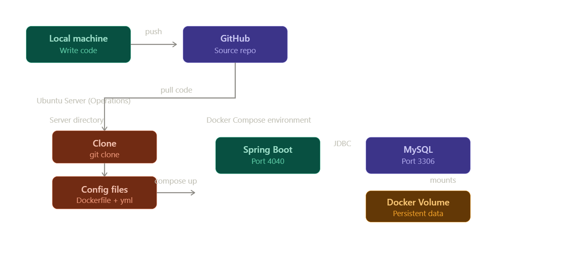
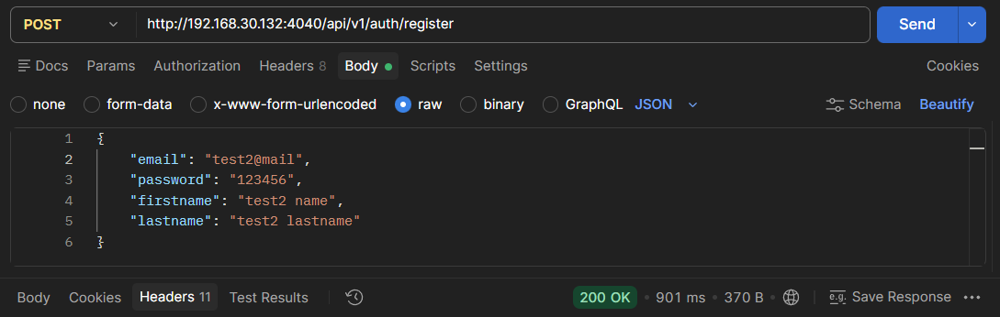
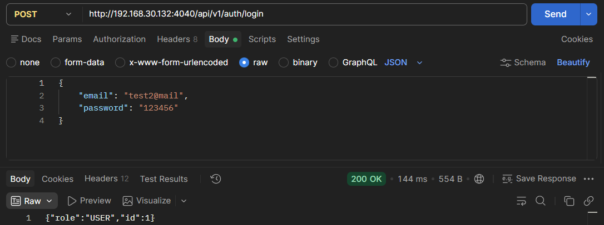
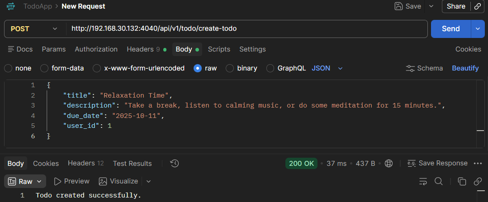
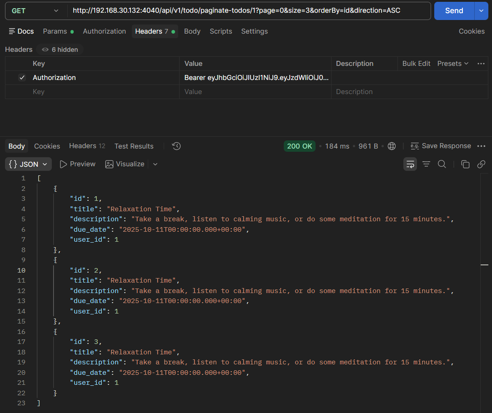

## Project Description
This project demonstrates the containerization and multi-container orchestration of a Java Spring Boot backend application integrated with a MySQL relational database. Unlike the previous build-and-ship registry workflow, this project establishes a direct "Source-to-Server" DevOps pipeline. The primary goal is to use **Docker Compose** to seamlessly build the application image directly on the server and orchestrate the backend and database containers within an isolated custom network, ensuring data persistence via Docker Volumes.

## Deployment Workflow
The deployment architecture follows a Git-driven Source-to-Server pipeline:
1. **Develop & Push:** Write the application code, `Dockerfile`, and `docker-compose.yml` locally, then push the source code to a GitHub repository.
2. **Clone:** Connect to the remote Ubuntu server, install Git, and clone the repository directly to the production environment.
3. **Build:** Use Docker Compose on the server to automatically execute a multi-stage Dockerfile to compile the Java `.jar` artifact and build the backend image.
4. **Orchestrate & Deploy:** Spin up both the Spring Boot and MySQL containers simultaneously using `docker compose up`, automatically configuring their internal DNS, port mappings, and persistent volume mounts.

## Lab Environment Setup
To simulate this Git-driven production deployment, the following infrastructure was established:

* **Local Machine (Development Environment):**
    * **Tools:** IDE (IntelliJ IDEA / VS Code), Git.
    * **Purpose:** Developing the Spring Boot application and pushing the source code to GitHub.
      <br><br/>
* **Remote Server (Production Environment):**
    * **Hypervisor:** VMware Workstation.
    * **Operating System:** Ubuntu Server.
    * **Tools:** Git, Docker Engine, Docker Compose CLI.
    * **Purpose:** Acting as the combined build-and-run host machine. It is responsible for cloning the source code, building the Docker images locally, and orchestrating the multi-container database and backend architecture.



## Deployment Steps

### 1. Connect to the Server and Install Git
Since our deployment strategy relies on pulling the source code directly to the production environment, the Ubuntu server needs `git` installed.

First, connect to your server and switch to the root user to ensure you have the necessary permissions:

```bash
# 1. Connect to the remote Ubuntu server via SSH
ssh <USERNAME>@<SERVER_IP_ADDRESS>

# 2. Switch to root privileges
sudo su

# 3. Update the package index and install Git
apt update
apt install git -y

# 4. Verify the installation
git --version
```
* **`apt install git -y`**: Downloads and installs the Git version control system. The `-y` flag automatically answers "yes" to any prompts during the installation process.

### 2. Clone the Application Repository
Now that Git is ready, we will download the raw Spring Boot application source code directly from GitHub to our server.

```bash
# 1. Navigate to the home or root directory (optional but recommended for workspace organization)
cd /root

# 2. Clone the Spring Boot TodoApp repository
git clone https://github.com/serkan-y38/SpringBoot-TodoApp

# 3. Enter the project directory
cd SpringBoot-TodoApp

# 4. List the files to verify the structure
ls -al
```

### 3. Create the Multi-Stage `Dockerfile`
Instead of installing Java and Maven directly on our Ubuntu server, we will use Docker's multi-stage build feature. The first stage will compile our Java code into a standalone `.jar` file, and the second stage will package only that compiled file into a lightweight runtime image.

Ensure you are inside the `SpringBoot-TodoApp` directory, and create the `Dockerfile` using the `nano` text editor:

```bash
nano Dockerfile
```

Paste the following configuration into the editor:

```dockerfile
# --- Build Stage ---
# Use an official Maven image with JDK 17 to compile the application
FROM maven:3.9-eclipse-temurin-17-alpine AS builder

# Set the working directory
WORKDIR /build

# Copy the pom.xml file first to cache dependencies
COPY pom.xml .

# Download dependencies (this caches them in a separate Docker layer)
RUN mvn dependency:go-offline

# Copy the actual source code
COPY src ./src

# Compile the code and package it into a .jar file (skipping tests for faster builds)
RUN mvn clean package -DskipTests


# --- Production Stage ---
# Use a lightweight JRE (Java Runtime Environment) image to run the application
FROM eclipse-temurin:17-jre-alpine

# Set the working directory inside the container
WORKDIR /app

# Copy the compiled .jar file from the 'builder' stage
# (Spring Boot typically creates the jar inside the /target folder)
COPY --from=builder /build/target/*.jar app.jar

# Document that the container uses port 8080 internally
EXPOSE 8080

# Run the Spring Boot application
ENTRYPOINT ["java", "-jar", "app.jar"]
```

**How to save and exit in nano:**
1. Press `Ctrl + O` to save.
2. Press `Enter` to confirm the filename.
3. Press `Ctrl + X` to exit.

#### Why Multi-Stage?
If we only used the `maven` image, our final Docker image would be massive (over 800MB) because it contains the entire Java compiler, Maven build tools, and downloaded source dependencies. By switching to the `jre-alpine` image in the second stage, our final production image will only be around 150MB, containing nothing but what is strictly necessary to run the app.

### 4. Create the `.env` File for Secure Configuration
Hardcoding passwords in a `docker-compose.yml` file is a major security risk. Instead, we will store all sensitive credentials and environment-specific variables in a separate `.env` file. Docker Compose automatically reads this file and injects the variables into the containers.

Create the `.env` file in the project root:

```bash
nano .env
```

Paste the following configurations (matching your Spring Boot `application.properties` needs):

```env
# The JWT Secret Key, database password, and username are currently hardcoded in the application.properties for this lab.
# However, in a production environment, you should NEVER hardcode secrets in source code.
# They must be securely injected via an environment variable like this:

# MySQL Database Credentials
DB_NAME=todo_db
DB_USER=root

# In the application.properties file, the password is 'password'.
# We intentionally changed it to 'your_secure_password_here' here to prove that the docker-compose.yml 
# environment variables successfully override the application.properties file at runtime.
DB_PASSWORD=your_secure_password_here 

# Spring Boot Overrides
# Overrides the 'localhost' URL in application.properties to use the Docker DNS name 'mysql-db'
SPRING_DB_URL=jdbc:mysql://mysql-db:3306/todo_db

# JWT Secret Key
JWT_SECRET=your_jwt_secret_here
```
*(Save and exit nano: `Ctrl+O`, `Enter`, `Ctrl+X`)*

> **Best Practice:** In a real-world scenario, you must add `.env` to your `.gitignore` file so that your database passwords and secret keys are never published to GitHub.

### 5. Create the `docker-compose.yml` File
Now we will define our multi-container architecture.

Create the compose file:

```bash
nano docker-compose.yml
```

Paste the following infrastructure-as-code configuration:

```yaml
version: '3.8'

services:
  # 1. Database Service
  mysql-db:
    image: mysql:8.0
    container_name: todo-mysql
    restart: unless-stopped
    environment:
      MYSQL_DATABASE: ${DB_NAME}
      MYSQL_ROOT_PASSWORD: ${DB_PASSWORD}
    volumes:
      - db_data:/var/lib/mysql
    healthcheck:
      # Use the variable in the ping command to verify the DB is ready
      test: ["CMD", "mysqladmin", "ping", "-h", "localhost", "-u", "root", "-p${DB_PASSWORD}"]
      interval: 10s
      timeout: 5s
      retries: 5

  # 2. Backend Application Service
  backend-app:
    build: .
    container_name: todo-backend
    restart: unless-stopped
    ports:
      - "4040:8080"
    environment:
      # These variables override the hardcoded values in application.properties
      SPRING_DATASOURCE_URL: ${SPRING_DB_URL}
      SPRING_DATASOURCE_USERNAME: ${DB_USER}
      SPRING_DATASOURCE_PASSWORD: ${DB_PASSWORD}
      APPLICATION_SECURITY_JWT_SECRET_KEY: ${JWT_SECRET}
      SPRING_JPA_HIBERNATE_DDL_AUTO: update
    depends_on:
      mysql-db:
        condition: service_healthy

volumes:
  db_data:
```
*(Save and exit nano: `Ctrl+O`, `Enter`, `Ctrl+X`)*

### 6. Create the `.dockerignore` File
Just like `.gitignore`, a `.dockerignore` file prevents unnecessary or sensitive files from being sent to the Docker daemon during the build process. This speeds up the build significantly and ensures secrets (like our `.env` file) don't accidentally leak into the final image.

Create the file in the project root:

```bash
nano .dockerignore
```

Paste the following exclusions:

```text
# Version control
.git
.gitignore

# Environment variables and secrets
.env

# IDE and OS files
.idea
.vscode
.DS_Store

# Local Maven build artifacts (Docker will build its own)
target/
*.jar

# Maven Wrapper files (We use the official Maven image in our Dockerfile)
.mvn
mvnw
mvnw.cmd
```
*(Save and exit nano: `Ctrl+O`, `Enter`, `Ctrl+X`)*

### 7. Build and Run the Infrastructure
Now comes the magic of Docker Compose. With a single command, Docker will pull the MySQL image, build our custom Spring Boot image from the raw Java source code, set up the internal DNS network, and start both containers in the correct dependency order.

Execute the following command in the project root:

```bash
docker compose up -d --build
```

* **`up`**: Orchestrates and starts all services defined in the `docker-compose.yml`.
* **`-d`** (Detached mode): Runs the containers in the background, giving you your terminal prompt back.
* **`--build`**: Forces Docker to execute the multi-stage `Dockerfile` and build a fresh image for the backend before starting it.

### 8. Monitor the Startup Logs
Since we started the containers in the background, we need to verify that Spring Boot successfully connected to the MySQL database and initialized Hibernate.

Run this command to watch the live logs of both containers:

```bash
docker compose logs -f
```
*(To exit the live log view, simply press `Ctrl+C`)*

### 9. Verify Running Processes
To confirm that all containers are actively running and port mappings are correct, execute:

```bash
docker ps
```

**Verification Checklist:**
* **`todo-backend`**: Up and running, successfully mapped to port `4040` (`4040->8080/tcp`).
* **`todo-mysql`**: Up and running as the database service.
* **`web-app`**: If your previous frontend container is running, it continues safely on port `8080` without conflicts.

### 10. Test the API with Postman
With the infrastructure running, we can now test the Spring Boot REST API from our local machine using the Postman Desktop app.

https://github.com/serkan-y38/SpringBoot-TodoApp/blob/main/README.md

For all requests, use your Ubuntu VM's IP address and the exposed port `4040`

The base URL structure is: `http://<YOUR_UBUNTU_IP>:4040`

* **User Registration:** A `POST` request to `/api/v1/auth/register` successfully created a new test user in the database, returning a `200 OK` status.



* **User Authentication:** A `POST` request to `/api/v1/auth/login` authenticated the user and returned the assigned role and user ID.



* **Data Creation:** A `POST` request to `/api/v1/todo/create-todo` successfully inserted a new task into the database, confirming the Spring Data JPA and Hibernate configuration is working.



* **Data Retrieval & Pagination:** A `GET` request to `/api/v1/todo/paginate-todos` successfully fetched a paginated JSON array of the created tasks, proving seamless read operations from the MySQL container.



### 11. Verify Database Records
To definitively prove that our API requests successfully persisted data inside the database, we can access the MySQL container's interactive terminal and query the tables directly.

1. Access the running MySQL container's bash shell:
   ```bash
   docker exec -it todo-mysql bash
   ```

2. Log into the MySQL command-line client using the root user. When prompted for the password, use the one defined in our `.env` file:
   ```bash
   mysql -u root -p
   ```

3. Once inside the MySQL monitor (indicated by the `mysql>` prompt), run the following SQL commands to inspect the data:
   ```sql
   -- Switch to our application database
   USE todo_db;

   -- List all tables (Hibernate auto-generated these based on our Java entities)
   SHOW TABLES;

   -- View the created todos
   SELECT * FROM todo_table;
   ```

4. Type `exit;` to leave the MySQL monitor, and type `exit` again to leave the container shell and return to your Ubuntu host.

## Conclusion
This project successfully demonstrates a modern Source-to-Server deployment pipeline. By utilizing a multi-stage `Dockerfile` and `docker-compose.yml`, we containerized a Spring Boot backend and a MySQL database directly on the production server. We effectively avoided port conflicts, secured database credentials using `.env` variable overrides, optimized image builds with `.dockerignore`, and ensured seamless service synchronization through automated health checks.


